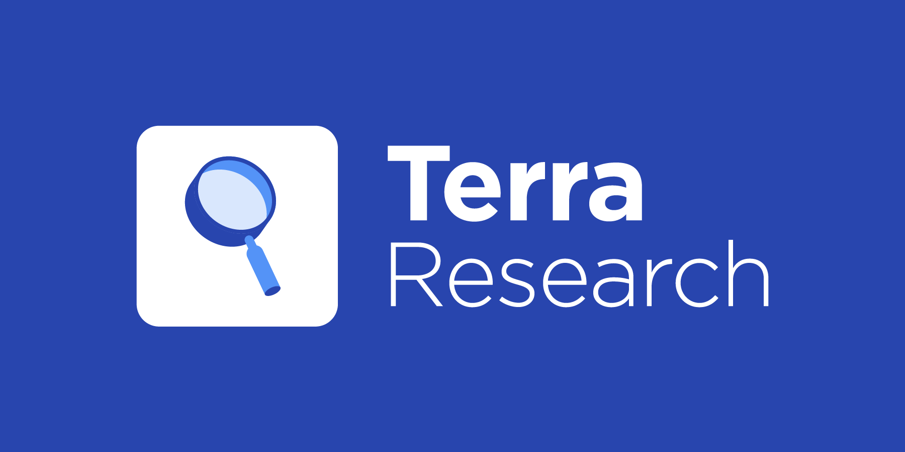

# Terra Research


Codebase for Terra Research. Projects span all layers of the Terra stack: blockchain, stability, dApps, e-commerce and beyond.

## Requirements

* Python 3.6 or above
* Basic python packages found in requirements.txt (numpy, pandas etc)

## Setup

The easiest and most reliable way to run the code is by setting up a python virtual environment. If you've never done this before, follow these straightforward [instructions](https://docs.python-guide.org/dev/virtualenvs/#lower-level-virtualenv). In addition, [virtualenvwrapper](https://docs.python-guide.org/dev/virtualenvs/#virtualenvwrapper) provides handy shortcuts for interracting with virtualenvs and helps organize them. Make sure you install Python 3.6 or above in your virtualenv.

After you activate your virtualenv, clone the research repo and run the following to install required dependencies:

```
pip install -r requirements.txt
```

You're all set!

## Projects

The codebase is organized into projects. Project-wide utilities are found under the utils directory. Each project has its own detailed documentation.

- [Terra for e-commerce payments](./applications/payments/README.md) 
- [Treasury Funding Weights](./funding_weights/README.md)
- [Mining Rewards Modeling and Control](./mining_rewards/README.md)